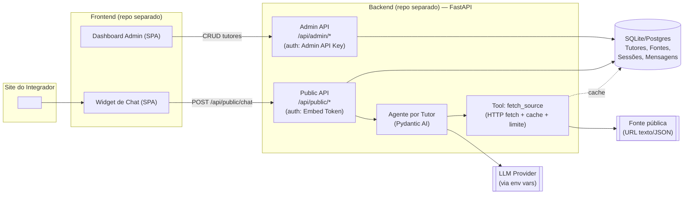
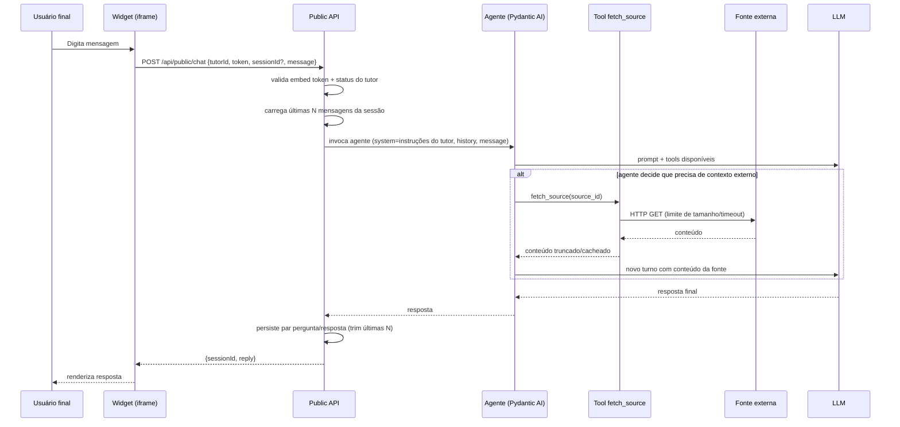
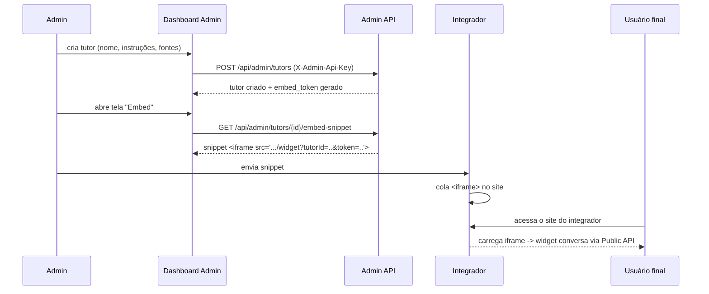
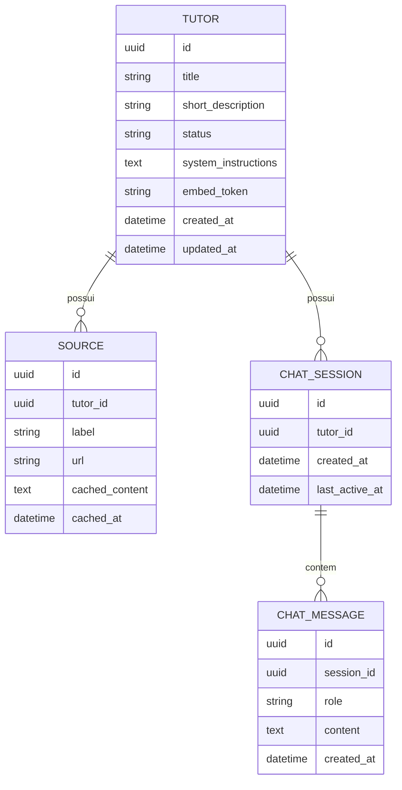

# Implementation Plan — Plataforma de Tutores Personalizados

> Baseado em: `Cópia de PRD - Plataforma de tutores personalizados.pdf` (Proposta nº 20260520_DOT_PRD-TUTORES, v1.0, 20/05/2026)
> Status: **implementado** — este documento foi escrito na fase de planejamento (antes de
> qualquer código) e mantido como registro histórico das decisões; o estado real do sistema
> está descrito nos READMEs de [`tutores-backend`](https://github.com/GabrielFerreira7/tutores-backend)
> e [`tutores-frontend`](https://github.com/GabrielFerreira7/tutores-frontend), que têm
> precedência sobre este plano em caso de divergência. Cópia idêntica também existe em
> [`tutores-backend/docs/IMPLEMENTATION_PLAN.md`](https://github.com/GabrielFerreira7/tutores-backend/blob/main/docs/IMPLEMENTATION_PLAN.md).

---

## Overview

O desafio pede um **MVP funcional** de uma plataforma onde administradores criam e configuram "tutores" (agentes conversacionais com persona, instruções e fontes de conhecimento) e integradores os incorporam em qualquer site via **iframe** — sem LTI, sem SSO educacional, sem lojas de LMS.

Duas restrições definem a espinha dorsal técnica do projeto:

1. **Estratégia de conhecimento agêntica, não vetorial**: o agente deve decidir, via *tool calling*, como buscar/compilar contexto (ex.: buscar uma fonte, ler seu conteúdo, resumir) em vez de depender de embeddings/vector DB.
2. **Orquestração obrigatória via LangChain ou Pydantic AI**, com a escolha justificada no README.

O produto final é composto por **dois repositórios Git independentes** (backend e frontend), cada um com testes, lint, Docker e documentação própria, e o processo de construção deve ser feito através de agentes de codificação (não codificação manual arquivo a arquivo).

---

## Requirements

### Requisitos funcionais (do PRD, seção 4)

| # | Requisito | Critério de aceite |
|---|---|---|
| RF1 | CRUD de tutor (criar, listar, editar, desativar) com nome, descrição curta, instruções de sistema, fontes opcionais | Endpoints admin funcionais e testados |
| RF2 | Modelo de tutor com id, título, status (ativo/inativo), instruções, e referência a 1+ fontes (URLs públicas texto/JSON, fetch simples com limites) | Tutor persistido com esses campos |
| RF3 | API REST protegida para papel administrativo (JWT ou API key admin) | Rotas admin exigem credencial válida; 401/403 caso contrário |
| RF4 | Rota/página que renderiza somente o widget de chat, pronta para iframe | `/widget?...` carrega em `<iframe>` isolado |
| RF5 | Pipeline de resposta orquestrado por agente (LangChain **ou** Pydantic AI), com decisão documentada | Seção "Decisões de arquitetura" no README do backend |
| RF6 | Agente usa ferramentas para buscar/compilar conhecimento, não vector DB/embeddings como estratégia principal | Nenhuma dependência de vector store no core |
| RF7 | Chamadas a LLM via variáveis de ambiente (chave, endpoint), `.env.example` sem segredos reais | `.env.example` presente e sem valores reais |
| RF8 | Persistência de tutores/metadados (Postgres, SQLite, ou outro — trade-off justificado) | Dados sobrevivem a restart do processo |
| RF9 | Persistência de histórico mínimo de conversa (últimas N mensagens por sessão/tutor) | Reload do iframe mantém contexto da sessão |
| RF10 | Snippet/documentação de embed (URL do iframe + instruções) | Endpoint ou página que gera o snippet copiável |
| RF11 | Autenticação de integração via API key/token de embed, sem vazar segredos desnecessários no front público | Token de embed é escopado ao tutor, não é a chave admin |

### Requisitos não funcionais (PRD seção 5)

| # | Requisito | Critério de aceite |
|---|---|---|
| RNF1 | Sem vazamento de stack trace nas respostas de API | Handler de erro global retorna payload genérico |
| RNF2 | Rate limit simples ou justificativa se omitido | Middleware de rate limit na rota de chat pública |
| RNF3 | CORS coerente com cenário de iframe | Configuração explícita, documentada |
| RNF4 | Logs estruturados/legíveis para depurar falhas de ferramentas do agente | Logs com nível, timestamp, contexto de tool call |
| RNF5 | Testes automatizados em pontos críticos (serviço de tutor e/ou rota de chat) | Suite de testes rodando em CI local (`pytest`/`vitest`) |
| RNF6 | Linter/formatador configurados nos dois repositórios | `ruff`/`black` (backend), `eslint`/`prettier` (frontend) |
| RNF7 | README com setup local, env vars, fluxo embed ponta a ponta | README completo em cada repo |

### Fora de escopo (explícito, PRD seção 6)

LTI 1.x/1.3, RAG vetorial/embeddings, pagamentos/faturamento, multi-tenant avançado com isolamento forte, app mobile nativo. **Não implementar nada disso.**

### Critérios de aceite finais (PRD seção 7) — checklist mestre

- [ ] Dois repositórios (backend + frontend), histórico de commits coerente com uso de agentes
- [ ] Tutor criável via API/admin e referenciável no embed
- [ ] Página de widget carrega em iframe e conversa com o backend
- [ ] Orquestração LangChain **ou** Pydantic AI, sem vector DB/embeddings como núcleo
- [ ] READMEs com decisões, limitações do MVP, reprodução do demo
- [ ] Confirmação explícita no README de que o código foi produzido via agentes de codificação
- [ ] Diagrama simples de arquitetura (ASCII ou imagem)
- [ ] Lista de "próximos passos" para produção (sem implementar)

---

## Proposed Solution

Um backend **FastAPI (Python)** expõe duas superfícies de API:

- **Admin API** (`/api/admin/*`), protegida por API key de administrador, para CRUD de tutores e geração do snippet de embed.
- **Public/Embed API** (`/api/public/*`), protegida por um **embed token escopado por tutor**, usada exclusivamente pelo widget dentro do iframe para enviar mensagens e obter histórico da sessão.

Cada tutor tem um **agente Pydantic AI** construído dinamicamente a partir de suas `system_instructions` e da lista de fontes cadastradas. O agente recebe uma *tool* (`fetch_source`) que busca o conteúdo de uma fonte (URL pública texto/JSON) sob demanda, com limite de tamanho e cache com TTL — é o próprio LLM que decide, por *tool calling*, quando precisa consultar uma fonte para responder. Não há indexação vetorial nem pré-processamento em embeddings.

O frontend é uma **SPA React + Vite** com duas áreas dentro do mesmo repositório (mas rotas independentes, sem dependência cruzada de estado):

1. **Dashboard admin** (`/admin/*`): login simples via API key, CRUD de tutores, tela de snippet de embed.
2. **Widget de embed** (`/widget`): página minimalista, sem navegação, pensada para ser carregada só dentro de um `<iframe>`, que conversa com a Public API.

A comunicação widget↔backend é **HTTP request/response simples** (não WebSocket) — decisão documentada na seção Architecture abaixo — o que simplifica infraestrutura, CORS e deploy, mantendo boa UX via *loading state* no envio de mensagem (e abre caminho para SSE/streaming como melhoria futura).

Persistência via **SQLite + SQLModel** para o MVP (zero infraestrutura extra, arquivo único, fácil de rodar em Docker/CI), com a camada de acesso a dados desenhada para trocar para PostgreSQL apenas mudando `DATABASE_URL` (mesmo dialeto SQLAlchemy).

---

## Architecture

### Componentes e fluxo de dados



### Fluxo de conversa (sequência)



### Fluxo de setup de embed



### Modelo de dados (visão lógica)



### Decisões de arquitetura (a documentar no README do backend)

| Decisão | Escolha | Justificativa | Alternativa considerada |
|---|---|---|---|
| Orquestração de agente | **Pydantic AI** | Tipagem forte nativa com Pydantic (facilita validar entradas/saídas de tools), API mais enxuta e menos "mágica" que LangChain, ótimo encaixe para um agente único com poucas tools bem definidas — reduz superfície de complexidade em um MVP | LangChain: ecossistema maior de integrações prontas, mas overhead de abstração (chains, callbacks) desnecessário para o escopo deste desafio |
| Transporte de chat | **HTTP REST request/response** | Mais simples de implementar, testar e hospedar; CORS trivial; sem necessidade de infra de conexão persistente para um MVP de baixo volume | WebSocket: melhor para streaming token-a-token, mas adiciona complexidade de conexão/reconexão dentro de um iframe sem ganho claro no escopo mínimo |
| Auth admin | **API key estática via header** (`X-Admin-Api-Key`) | PRD permite JWT *ou* API key; API key evita construir fluxo de login/usuários/hash de senha para um único papel administrativo — "segurança mínima aceitável para demo" | JWT: mais "correto" para múltiplos admins, mas overengineering para MVP de 1 papel |
| Auth embed | **Token de embed por tutor**, escopado somente ao chat daquele tutor | Não expõe a API key admin no front público; permite revogar/rotacionar por tutor sem afetar os demais | Token global único: mais simples, mas vaza blast radius maior se exposto |
| Persistência | **SQLite via SQLModel/SQLAlchemy** | Zero infraestrutura extra, arquivo único versionável em volume Docker, ideal para demo/dev; camada ORM permite trocar para Postgres só mudando `DATABASE_URL` | PostgreSQL: mais robusto para concorrência real, recomendado como próximo passo de produção |
| Estratégia de conhecimento | **Tool `fetch_source` com fetch HTTP simples + cache TTL**, decisão de uso feita pelo LLM via tool calling | Atende exigência explícita do PRD (agente decide, sem vector DB); cache evita custo/latência repetidos | Crawler completo ou pré-processamento: fora de escopo, complexidade desnecessária |

---

## Technology Stack

### Backend

| Tecnologia | Papel | Motivo |
|---|---|---|
| Python 3.11+ | Linguagem | Compatível com Pydantic AI; tipagem moderna |
| FastAPI | Framework web | Async nativo, validação via Pydantic, OpenAPI automático (facilita documentar a API para o integrador) |
| Pydantic AI | Orquestração do agente | Ver justificativa na tabela de decisões acima |
| SQLModel (SQLAlchemy + Pydantic) | ORM/persistência | Um único modelo serve de schema de API e de tabela, reduz duplicação |
| SQLite (dev/demo) / PostgreSQL (opcional via env) | Banco de dados | Ver trade-off acima |
| httpx | Cliente HTTP assíncrono | Usado pela tool `fetch_source` para buscar conteúdo externo com timeout/limite |
| slowapi (ou middleware próprio) | Rate limiting | Atende RNF2 de forma simples, baseada em IP/sessão |
| structlog (ou logging padrão + formatter JSON) | Logs estruturados | Atende RNF4, facilita depurar falhas de tool call |
| pytest + pytest-asyncio + httpx.AsyncClient | Testes | Testa serviço de tutor e rota de chat com LLM mockado |
| ruff + ruff format (ou black) | Lint/format | Um único binário para lint+format, configuração mínima |
| uvicorn | Servidor ASGI | Padrão para FastAPI |

### Frontend

| Tecnologia | Papel | Motivo |
|---|---|---|
| React + TypeScript | UI | Tipagem compartilhável com contratos da API; ecossistema maduro |
| Vite | Build/dev server | Setup rápido, build enxuto para servir estático via Docker/nginx |
| React Router | Roteamento | Separar `/admin/*` de `/widget` como fluxos independentes no mesmo app |
| fetch nativo (ou axios leve) | Cliente HTTP | Evitar dependência pesada desnecessária |
| CSS simples (sem design system pesado) | Estilo | Widget precisa ser leve para carregar bem dentro de iframe; evita overengineering visual |
| ESLint + Prettier | Lint/format | Padrão da comunidade React |
| Vitest + React Testing Library | Testes (leve) | Cobrir formulário de tutor e render do widget |

### Docker

Faz sentido usar Docker aqui porque reduz fricção de "como rodar isso na entrevista": dois repositórios, um deles com dependência de chave de LLM. **Não** será usado Kubernetes, nem orquestração multi-serviço complexa — apenas:

- `backend/Dockerfile`: imagem Python slim + uvicorn.
- `backend/compose.yaml`: sobe o backend com volume para o arquivo SQLite; variável `DATABASE_URL` trocável para apontar a um Postgres externo se o avaliador preferir.
- `frontend/Dockerfile`: build multi-stage (Vite build → servir estático via `nginx` ou `vite preview`).
- `frontend/compose.yaml`: sobe o frontend já com `VITE_API_BASE_URL` apontando para o backend.
- `.env.example` em cada repositório (nunca `.env` real commitado).

Cada repositório é independente e pode ser executado isoladamente (`docker compose up`); não há orquestração cruzada obrigatória entre os dois repos — a documentação explica como apontar um para o outro via variável de ambiente.

---

## Project Structure

### Repositório `tutores-backend/`

```
tutores-backend/
├── app/
│   ├── main.py                  # bootstrap FastAPI, middlewares, exception handlers
│   ├── config.py                # settings via env vars (pydantic-settings)
│   ├── db.py                    # engine/session SQLModel
│   ├── models/
│   │   ├── tutor.py
│   │   ├── source.py
│   │   └── chat.py
│   ├── schemas/                 # request/response Pydantic (se diferente dos models)
│   ├── api/
│   │   ├── admin/
│   │   │   ├── tutors.py        # CRUD + embed-snippet
│   │   │   └── deps.py          # dependência de auth admin
│   │   └── public/
│   │       ├── chat.py          # POST /chat, GET /chat/{session}/history
│   │       └── deps.py          # dependência de auth embed token
│   ├── agent/
│   │   ├── factory.py           # monta agente Pydantic AI por tutor
│   │   └── tools.py             # fetch_source (fetch + cache + limites)
│   ├── services/
│   │   ├── tutor_service.py
│   │   └── chat_service.py
│   └── core/
│       ├── logging.py
│       ├── rate_limit.py
│       └── errors.py            # exception handlers (sem stack trace no payload)
├── tests/
│   ├── test_tutor_service.py
│   ├── test_chat_route.py
│   └── test_fetch_source_tool.py
├── Dockerfile
├── compose.yaml
├── .env.example
├── pyproject.toml               # deps + ruff config
└── README.md
```

### Repositório `tutores-frontend/`

```
tutores-frontend/
├── src/
│   ├── main.tsx
│   ├── router.tsx                # separa rotas /admin/* e /widget
│   ├── admin/
│   │   ├── ApiKeyGate.tsx        # tela simples de "cole sua admin key"
│   │   ├── TutorListPage.tsx
│   │   ├── TutorFormPage.tsx
│   │   └── EmbedSnippetPage.tsx
│   ├── widget/
│   │   ├── WidgetPage.tsx        # ponto de entrada carregado no iframe
│   │   └── ChatWindow.tsx
│   ├── api/
│   │   ├── adminClient.ts
│   │   └── publicClient.ts
│   └── types/
│       └── tutor.ts
├── public/
│   └── embed-demo.html           # página de exemplo simulando o site do integrador
├── tests/
│   ├── TutorFormPage.test.tsx
│   └── WidgetPage.test.tsx
├── Dockerfile
├── compose.yaml
├── .env.example
├── package.json
└── README.md
```

> **Assumption**: como o ambiente atual não é um repositório Git, o planejamento assume que na fase de implementação serão inicializados **dois diretórios/repositórios independentes** (`tutores-backend/` e `tutores-frontend/`), cada um com seu próprio `git init` e remoto próprio — não um monorepo com subpastas de um único repo.

---

## Implementation Plan

Etapas pequenas e incrementais, pensadas para serem conduzidas via agente de codificação com revisão a cada passo.

1. **Setup**
   Objetivo: inicializar os dois repositórios com scaffolding mínimo (FastAPI + Pydantic AI + SQLModel no backend; Vite + React + TS no frontend), lint/format configurados, `.env.example`, Dockerfile/compose básicos, endpoint `/health`.
   Validação: `uvicorn app.main:app` sobe e `/health` retorna 200; `npm run dev` sobe página em branco sem erros de build; `ruff check` e `eslint` passam limpos.

2. **Core de domínio e persistência**
   Objetivo: modelos `Tutor`, `Source`, `ChatSession`, `ChatMessage`; camada de serviço (`tutor_service`) com CRUD; criação de schema no SQLite.
   Validação: testes unitários do `tutor_service` (criar/listar/editar/desativar) passam; arquivo `.db` é gerado com as tabelas esperadas.

3. **Admin API**
   Objetivo: rotas REST de gestão de tutor protegidas por `X-Admin-Api-Key`, endpoint de snippet de embed (gera token e URL do iframe).
   Validação: testes de integração via `TestClient` cobrindo sucesso e 401/403 sem credencial; smoke test manual com `curl`/Swagger UI (`/docs` do FastAPI).

4. **Agente e ferramentas de conhecimento**
   Objetivo: montar agente Pydantic AI por tutor (system prompt = `system_instructions`), implementar tool `fetch_source` com timeout, limite de tamanho e cache com TTL; configurar provedor de LLM via env vars.
   Validação: teste unitário do agente com LLM e HTTP mockados (sem custo real); teste manual pontual com uma URL pública real e uma chave de API válida.

5. **API de chat e persistência de sessão**
   Objetivo: `POST /api/public/chat` validando embed token e status do tutor, carregando/persistindo últimas N mensagens, tratamento de erros (tutor inativo, token inválido, fonte indisponível).
   Validação: teste de integração de ida e volta de conversa (2-3 turnos) confirmando que o histórico persiste e é truncado corretamente em N.

6. **Dashboard admin (frontend)**
   Objetivo: tela de entrada da API key, listagem/criação/edição/desativação de tutor, tela de snippet de embed com botão de copiar.
   Validação: QA manual no navegador cobrindo o fluxo completo de criar → editar → desativar um tutor; testes de componente básicos no formulário.

7. **Widget e fluxo de embed (frontend)**
   Objetivo: rota `/widget` isolada (sem navegação/menu), sessão persistida em `localStorage`, chamada à Public API, página de exemplo (`embed-demo.html`) simulando o site do integrador com `<iframe>`.
   Validação: abrir `embed-demo.html` no navegador e completar uma conversa real ponta a ponta dentro do iframe.

8. **Hardening, observabilidade e documentação final**
   Objetivo: rate limiting na rota pública de chat, CORS restrito e documentado, exception handler global sem stack trace, logs estruturados nas tool calls, README de cada repo (setup, env vars, decisões de arquitetura, limitações, fluxo embed ponta a ponta, confirmação de uso de agentes de codificação), diagrama de arquitetura, lista de próximos passos.
   Validação: `docker compose up` nos dois repos entrega o demo funcional; suites de teste e linters passam limpos nos dois repos; teste manual forçando um erro (ex. tutor inexistente) confirma ausência de stack trace na resposta; teste manual excedendo o rate limit confirma 429.

---

## Testing

**Backend (foco principal, conforme RNF5):**
- Unitários: `tutor_service` (criar, listar, editar, desativar, validação de campos obrigatórios); tool `fetch_source` (sucesso, timeout, conteúdo acima do limite, URL inválida) com HTTP mockado via `respx`/`httpx` mock transport.
- Integração: rotas admin (CRUD completo + auth negativa); rota de chat pública (fluxo feliz, token inválido, tutor inativo) com o LLM mockado — **testes automatizados nunca devem chamar a API real do LLM**, para manter a suíte determinística e sem custo.
- Edge cases: mensagem vazia, sessão inexistente, fonte que retorna HTML/binário em vez de texto, fonte que não responde (timeout), embed token de outro tutor, colisão de geração de embed token.

**Frontend (leve, complementar):**
- Componente: formulário de tutor (validação de campos obrigatórios), render do `WidgetPage` (estado de loading, envio de mensagem, exibição da resposta).
- Não é o foco de cobertura do desafio (PRD pede "pelo menos serviço de tutor ou rota de chat"), mas evita regressão nas duas telas centrais.

**E2E:** fora do escopo formal, mas a validação manual da etapa 7 acima (embed-demo.html num navegador real) cumpre esse papel de forma leve, sem justificar a complexidade de introduzir Playwright/Cypress no MVP.

---

## Error Handling

| Cenário | Tratamento |
|---|---|
| Corpo de requisição inválido/campo obrigatório ausente | 400 com mensagem de validação (Pydantic), sem stack trace |
| Admin key ausente/incorreta | 401, payload genérico |
| Embed token ausente/incorreto/de outro tutor | 403, payload genérico |
| Tutor inexistente | 404 |
| Tutor inativo tentando ser usado no chat | 409/422 com mensagem clara ("tutor indisponível") |
| Fonte externa indisponível, timeout ou 4xx/5xx | Tool retorna aviso estruturado ("fonte indisponível") para o agente em vez de propagar exceção; agente informa a limitação ao usuário em vez de alucinar |
| Conteúdo de fonte excede limite de tamanho | Tool trunca e sinaliza truncamento ao agente |
| Erro/timeout do provedor LLM | Retry único simples; se falhar, resposta amigável ("não foi possível responder agora") sem vazar detalhe interno |
| Rate limit excedido | 429 com header `Retry-After` |
| Exceção não tratada (fallback) | Handler global do FastAPI: log completo no servidor, resposta genérica 500 ao cliente (RNF1) |
| Erro de banco (ex. colisão de token) | Regenerar token e tentar novamente (poucas tentativas) ou 409 |

---

## Security & Reliability

- **Segredos**: chaves de LLM e admin API key somente via variáveis de ambiente/`.env` (gitignored); `.env.example` versionado sem valores reais.
- **Escopo de credenciais**: admin API key nunca chega ao bundle do frontend público; o widget só recebe o embed token, escopado a um único tutor e apenas à operação de chat.
- **CORS**: allow-list configurável via env (`CORS_ALLOWED_ORIGINS`); documentar que em produção o ideal é restringir aos domínios dos integradores conhecidos (para o demo, pode ficar mais permissivo, com o risco documentado no README).
- **SSRF mínimo**: a tool `fetch_source` valida que a URL é `http(s)`, bloqueia IPs privados/loopback/link-local antes do fetch — mitigação básica, não completa (documentar como limitação conhecida do MVP).
- **Rate limiting**: por IP/sessão na rota pública de chat, para conter abuso do endpoint mais exposto.
- **Sem vazamento de stack trace**: handler de exceção global padronizado (RNF1).
- **Dependências**: versões fixadas em `pyproject.toml`/`package.json`; sem dependências desnecessárias (evitar overengineering de segurança além do "mínimo aceitável para demo" pedido no PRD).
- **Logs**: não logar conteúdo integral de chaves; truncar/mascarar tokens em logs de erro.

---

## Performance & Scalability

- **Cache de fontes** com TTL evita refetch repetido da mesma URL a cada mensagem — reduz latência e chance de rate limit no site de origem.
- **Histórico limitado a N mensagens** (configurável via env) mantém o prompt enxuto, controlando tokens/custo/latência do LLM.
- **I/O assíncrono** (FastAPI + httpx async) permite atender múltiplas conversas concorrentes sem bloquear o event loop durante fetch de fontes ou chamada ao LLM.
- **Gargalo esperado**: a chamada ao LLM é o passo mais lento do pipeline; para o MVP isso é aceitável (resposta síncrona), com streaming (SSE) documentado como melhoria futura para percepção de latência.
- **Limite de concorrência do SQLite**: adequado para demo/baixo volume; documentado como ponto de troca para PostgreSQL caso o volume cresça (a camada SQLModel já é agnóstica ao dialeto).
- **Stateless backend**: sem estado em memória entre requisições (exceto cache de fonte, que é apenas otimização), o que permite escalar horizontalmente assim que o banco deixar de ser SQLite local.

---

## AI/LLM

- **Framework de orquestração**: **Pydantic AI** (ver justificativa na tabela de Decisões de arquitetura).
- **Provedor de modelo**: **Assumption** — não especificado no PRD; o desenho assume um provedor configurável via env (`LLM_PROVIDER`, `LLM_MODEL`, `LLM_API_KEY`), com a Pydantic AI abstraindo o provedor concreto (ex. Anthropic Claude ou OpenAI), documentado explicitamente no README como decisão do candidato.
- **Prompting**: `system_instructions` do tutor mapeia 1:1 para o system prompt do agente; descrições de tool bem específicas (`fetch_source(source_id)`) orientam o LLM sobre quando buscar uma fonte.
- **Estratégia de "RAG agêntico"**: sem embeddings/índice — o agente decide, por tool calling, se e quando precisa de conteúdo externo; conteúdo é injetado no contexto da própria chamada em vez de pré-indexado.
- **Mitigação de alucinação**: instrução explícita no system prompt para o tutor admitir quando não sabe a resposta em vez de inventar; temperatura moderada/baixa por padrão.
- **Custo e latência**: limite de tokens de saída, limite de tamanho de conteúdo de fonte (ex. 20–50 KB truncados), cache de fonte, histórico limitado a N mensagens, timeout configurável na chamada ao LLM com fallback de erro amigável.
- **Avaliação**: fora do escopo um harness formal de avaliação; validação feita por QA manual de conversas roteiro (golden path + pergunta fora do conhecimento da fonte + pergunta sobre tutor inativo). Harness de avaliação automatizada é listado como próximo passo de produção.

---

## Risks & Assumptions

### Assumptions (marcadas explicitamente por ausência de detalhe no PRD)

- **A1**: Provedor de LLM não é especificado — desenho assume configuração via env, com um provedor padrão a escolher na implementação (ex. Anthropic Claude), documentado no README.
- **A2**: "Fontes" são limitadas a URLs públicas HTTP(S) retornando texto simples ou JSON — sem parsing de PDF, sem autenticação na fonte, sem crawler (conforme permitido explicitamente pelo PRD).
- **A3**: Um único papel administrativo, sem múltiplos usuários/login — API key estática é suficiente para o "mínimo aceitável para demo" pedido.
- **A4**: N (tamanho do histórico persistido) será um valor pequeno configurável (ex. 20 mensagens), não especificado no PRD.
- **A5**: ~~Dois repositórios Git distintos~~ — **atualização em 18/08/2026**: inicialmente construído como pastas locais dentro de um único repositório, depois efetivamente separado em dois repositórios Git independentes no GitHub — [`tutores-backend`](https://github.com/GabrielFerreira7/tutores-backend) e [`tutores-frontend`](https://github.com/GabrielFerreira7/tutores-frontend) — conforme o PRD (seção 2c) exige. Cada um com sua própria branch `development` (onde o trabalho é feito) e `main` (integrada via Pull Request), histórico de commits granular preservado na migração.
- **A6**: Token de embed é estático por tutor (sem expiração automática), rotacionável manualmente pelo admin — nível de segurança compatível com "aceitável para demo", não para produção multi-tenant real.

### Riscos técnicos

- **SSRF via URL de fonte arbitrária**: mitigação básica (bloqueio de IP privado/loopback) reduz mas não elimina o risco; documentar como limitação conhecida.
- **Custo/disponibilidade do provedor de LLM durante a demo**: testes automatizados devem mockar o LLM para não depender de créditos/API real no CI.
- **Imaturidade relativa do Pydantic AI** (biblioteca mais nova que LangChain): mitigar fixando a versão exata em `pyproject.toml` e isolando a integração numa camada (`app/agent/`) para facilitar troca futura.
- **SQLite sob concorrência real**: aceitável para demo; documentado caminho de migração para Postgres.

### Alternativas consideradas (resumo)

| Decisão | Escolhida | Alternativa | Por que não a alternativa |
|---|---|---|---|
| Orquestração | Pydantic AI | LangChain | Mais abstração/overhead do que o escopo pede |
| Transporte de chat | HTTP REST | WebSocket | Complexidade de conexão persistente sem ganho claro no MVP |
| Auth admin | API key estática | JWT + usuários | Overengineering para um único papel |
| Banco | SQLite | PostgreSQL | Zero infra extra para demo; troca é trivial via env |

---

## Definition of Done

- [ ] Todos os itens do checklist de **Critérios de aceite** (seção Requirements acima) atendidos
- [ ] Backend: CRUD de tutor, chat, tool de fonte, testes, lint, Docker, README completos
- [ ] Frontend: dashboard admin, widget de embed, `embed-demo.html`, testes leves, lint, Docker, README completos
- [ ] Nenhuma dependência de vector DB/embeddings no core de conhecimento
- [ ] `.env.example` presente e sem segredos reais nos dois repos
- [ ] Suítes de teste e linters passando limpos nos dois repos
- [ ] `docker compose up` funcional em cada repo, com instrução de como conectar frontend↔backend
- [ ] README com: como rodar localmente, variáveis de ambiente, decisões de arquitetura (LangChain vs Pydantic AI, HTTP vs WebSocket, etc.), limitações do MVP, fluxo embed ponta a ponta, confirmação explícita de uso de agentes de codificação
- [ ] Diagrama de arquitetura incluído (os diagramas Mermaid deste documento servem de base)
- [ ] Lista de "próximos passos para produção" documentada (ex.: Postgres, JWT multi-admin, streaming SSE, avaliação automatizada do agente, isolamento multi-tenant, expiração de embed token, WAF/SSRF hardening mais robusto)
- [ ] Nenhum item de "fora de escopo" (seção 6 do PRD) foi implementado

---

## Dúvidas / ambiguidades a validar com o avaliador (ou decidir e documentar como Assumption)

1. Provedor de LLM esperado (Anthropic, OpenAI, outro) — PRD não especifica; tratado como configurável (`LLM_MODEL`). Testado com Anthropic, OpenAI e, como fallback opcional sem chave paga, Ollama local (ver README do backend).
2. ~~Se "dois repositórios Git distintos" precisa ser literalmente dois repositórios remotos~~ — **resolvido**: são dois repositórios GitHub distintos, conforme A5 acima.
3. Valor esperado de N (tamanho do histórico persistido) — definido como configurável via `CHAT_HISTORY_LIMIT`, default 20.
4. Nível de rigor esperado para "segurança mínima aceitável para demo" — API key estática (admin) + token de embed escopado por tutor, ambos documentados no README do backend como decisão deliberada para o escopo do MVP.
